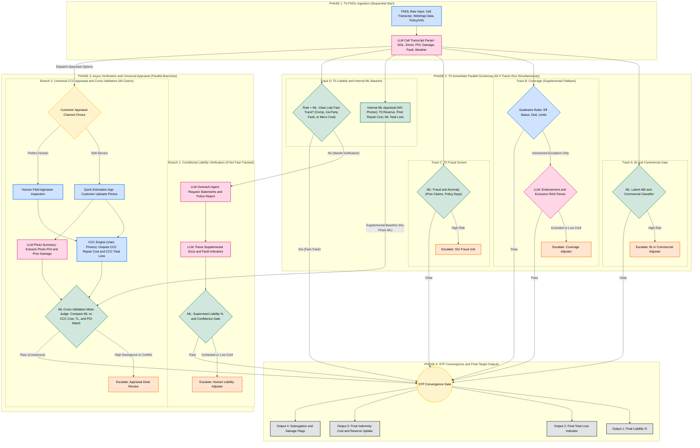

```mermaid
flowchart TB
    classDef llm fill:#ffd6e7,stroke:#d63384,stroke-width:2px,color:#000
    classDef ml fill:#d1e7dd,stroke:#198754,stroke-width:2px,color:#000
    classDef rule fill:#cfe2ff,stroke:#0d6efd,stroke-width:2px,color:#000
    classDef esc fill:#ffe5d0,stroke:#fd7e14,stroke-width:2px,color:#000
    classDef out fill:#e2e3e5,stroke:#383d41,stroke-width:2px,color:#000
    classDef gate fill:#fff3cd,stroke:#ffc107,stroke-width:2px,color:#000

    subgraph Phase1 ["PHASE 1: T0 FNOL Ingestion (Sequential Start)"]
        FNOL["FNOL Raw Input: Call Transcript, Web/App Data, Policy/VIN"]
        LLM_FNOL["LLM Call Transcript Parser: DOL, Driver, POI, Damage, Fault, Weather"]
        FNOL --> LLM_FNOL
    end

    subgraph Phase2 ["PHASE 2: T0 Immediate Parallel Screening (All 4 Tracks Run Simultaneously)"]
        direction LR

        subgraph TrackA ["Track A: BI and Commercial Gate"]
            ML_ABI{"ML: Latent ABI and Commercial Classifier"}
            ESC_ABI["Escalate: BI or Commercial Adjuster"]
            ML_ABI -- "High Risk" --> ESC_ABI
        end

        subgraph TrackB ["Track B: Coverage (Supplemental Fallback)"]
            RULE_COV{"Guidewire Rules: Eff Status, Ded, Limits"}
            LLM_COV{"LLM: Endorsement and Exclusion RAG Parser"}
            ESC_COV["Escalate: Coverage Adjuster"]

            RULE_COV -- "Unresolved Exception Only" --> LLM_COV
            LLM_COV -- "Excluded or Low Conf" --> ESC_COV
        end

        subgraph TrackC ["Track C: T0 Fraud Screen"]
            ML_FRAUD{"ML: Fraud and Anomaly (Prior Claims, Policy Days)"}
            ESC_SIU["Escalate: SIU Fraud Unit"]
            ML_FRAUD -- "High Risk" --> ESC_SIU
        end

        subgraph TrackD ["Track D: T0 Liability and Internal ML Baseline"]
            ML_APD_T0["Internal ML Appraisal (NO Photos): T0 Reserve, Pred Repair Cost, ML Total Loss"]
            GATE_FAST{"Rule + ML: Clear Liab Fast-Track? (Comp, 1st-Party Fault, or Micro Cost)"}
        end
    end

    LLM_FNOL --> ML_ABI
    LLM_FNOL --> RULE_COV
    LLM_FNOL --> ML_FRAUD
    LLM_FNOL --> ML_APD_T0
    LLM_FNOL --> GATE_FAST

    subgraph Phase3 ["PHASE 3: Async Verification and Universal Appraisal (Parallel Branches)"]
        direction LR

        subgraph AsyncLiab ["Branch 1: Conditional Liability Verification (If Not Fast-Tracked)"]
            LLM_INFO["LLM Outreach Agent: Request Statements and Police Report"]
            LLM_LIAB_SUM["LLM: Parse Supplemental Docs and Fault Indicators"]
            ML_LIAB_FINAL{"ML: Supervised Liability % and Confidence Gate"}
            ESC_LIAB["Escalate: Human Liability Adjuster"]

            LLM_INFO --> LLM_LIAB_SUM --> ML_LIAB_FINAL
            ML_LIAB_FINAL -- "Contested or Low Conf" --> ESC_LIAB
        end

        subgraph AsyncAppraisal ["Branch 2: Universal CCC Appraisal and Cross-Validation (All Claims)"]
            CUST_CHOICE{"Customer Appraisal Channel Choice"}
            APP_PHOTO["Quick Estimation App: Customer Uploads Photos"]
            HUM_APP["Human Field Appraiser Inspection"]

            CCC_EVAL["CCC Engine (Uses Photos): Outputs CCC Repair Cost and CCC Total Loss"]
            LLM_PHOTO["LLM Photo Summary: Extracts Photo POI and Prior Damage"]

            ML_XVAL{"ML Cross-Validation Meta-Judge: Compare ML vs CCC Cost, TL, and POI Match"}
            ESC_APD["Escalate: Appraisal Desk Review"]

            CUST_CHOICE -- "Self-Service" --> APP_PHOTO
            CUST_CHOICE -- "Prefers Human" --> HUM_APP
            APP_PHOTO --> CCC_EVAL
            APP_PHOTO --> LLM_PHOTO
            HUM_APP --> CCC_EVAL
            CCC_EVAL --> ML_XVAL
            LLM_PHOTO --> ML_XVAL
            ML_XVAL -- "High Divergence or Conflict" --> ESC_APD
        end
    end

    GATE_FAST -- "No (Needs Verification)" --> LLM_INFO
    ML_APD_T0 -- "Supplemental Baseline (No-Photo ML)" --> ML_XVAL
    LLM_FNOL -- "Dispatch Appraisal Options" --> CUST_CHOICE

    subgraph Phase4 ["PHASE 4: STP Convergence and Final Target Outputs"]
        JOIN(("STP Convergence Gate"))

        OUT_LIAB["Output 1: Final Liability %"]
        OUT_TL["Output 2: Final Total Loss Indicator"]
        OUT_PAY["Output 3: Final Indemnity Cost and Reserve Update"]
        OUT_POST["Output 4: Subrogation and Salvage Flags"]

        JOIN --> OUT_LIAB
        JOIN --> OUT_TL
        JOIN --> OUT_PAY
        JOIN --> OUT_POST
    end

    ML_ABI -- "Clear" --> JOIN
    RULE_COV -- "Pass" --> JOIN
    LLM_COV -- "Pass" --> JOIN
    ML_FRAUD -- "Clear" --> JOIN
    GATE_FAST -- "Yes (Fast-Track)" --> JOIN
    ML_LIAB_FINAL -- "Pass" --> JOIN
    ML_XVAL -- "Pass (Consensus)" --> JOIN

    class LLM_FNOL,LLM_COV,LLM_INFO,LLM_LIAB_SUM,LLM_PHOTO llm
    class ML_ABI,ML_FRAUD,ML_APD_T0,GATE_FAST,ML_LIAB_FINAL,ML_XVAL ml
    class FNOL,RULE_COV,APP_PHOTO,HUM_APP,CCC_EVAL rule
    class ESC_ABI,ESC_COV,ESC_SIU,ESC_LIAB,ESC_APD esc
    class CUST_CHOICE,JOIN gate
    class OUT_LIAB,OUT_TL,OUT_PAY,OUT_POST out
```
